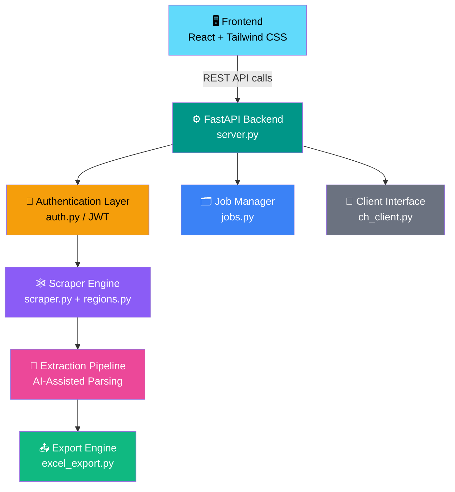
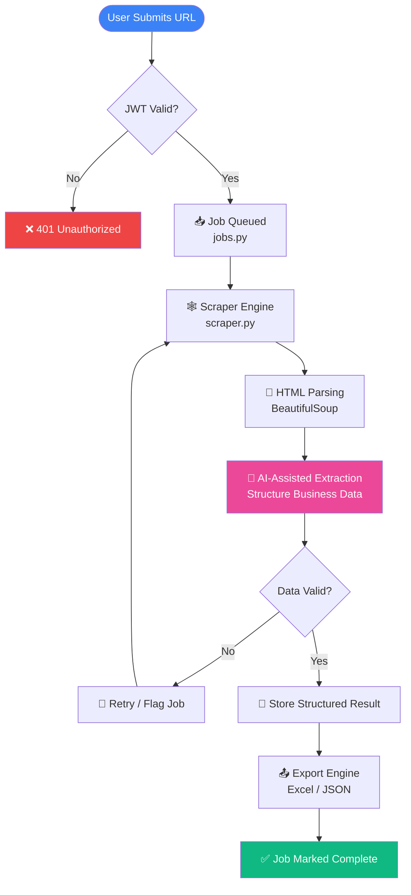

<div align="center">

# 🔍 Intelligent Data Extraction Platform

### AI-Assisted Business Data Extraction, Scraping & Job Management — Reimagined

Automate the extraction of structured business information from websites with an AI-assisted pipeline, background job orchestration, and a modern, responsive dashboard.

[](https://www.python.org/)
[](https://fastapi.tiangolo.com/)
[](https://react.dev/)
[](https://tailwindcss.com/)
[](#-license)
[](#)

[Overview](#-overview) • [Features](#-features) • [Architecture](#-architecture) • [Installation](#-installation) • [API Docs](#-api-documentation) • [Roadmap](#-future-roadmap)

</div>

---

## 📚 Table of Contents

- [Overview](#-overview)
- [Features](#-features)
- [Architecture](#-architecture)
- [Project Structure](#-project-structure)
- [Installation](#-installation)
- [Environment Variables](#-environment-variables)
- [API Documentation](#-api-documentation)
- [Frontend Pages](#-frontend-pages)
- [Extraction Workflow](#-extraction-workflow)
- [Security](#-security)
- [Performance](#-performance)
- [Future Roadmap](#-future-roadmap)
- [Screenshots](#-screenshots)
- [Deployment](#-deployment)
- [Development Guidelines](#-development-guidelines)
- [License](#-license)
- [Author](#-author)
- [Acknowledgements](#-acknowledgements)

---

## 🎯 Overview

Manually researching and compiling business information from company websites — names, addresses, contact details, registration data, and more — is slow, repetitive, and error-prone. Analysts and operations teams routinely burn hours copy-pasting data from disparate sources into spreadsheets before it's even usable.

**Intelligent Data Extraction Platform** solves this by combining automated web scraping with AI-assisted parsing to turn unstructured website content into clean, structured business records — all through a single dashboard, with authentication, job tracking, scheduling, and export built in.

### Why this platform exists

- Business information is scattered across websites in inconsistent formats.
- Manual research doesn't scale across hundreds or thousands of company domains.
- Teams need an auditable, repeatable pipeline — not a one-off script.

### Target Users

| User Type | Use Case |
|---|---|
| **Data / Research Analysts** | Bulk company data collection for market research |
| **Sales & Lead Gen Teams** | Enriching prospect lists with verified business details |
| **Operations Teams** | Maintaining structured records of vendor/partner companies |
| **Developers** | Extending or embedding an extraction pipeline into internal tools |

### Key Benefits

- ⚡ **Faster turnaround** — submit a URL, get structured data back
- 🧠 **AI-assisted parsing** — reduces manual cleanup of scraped content
- 📊 **Exportable output** — Excel/JSON ready for downstream use
- 🔐 **Secure by design** — JWT-protected APIs and scoped user access
- 🗂️ **Full job visibility** — track extraction jobs from submission to completion

---

## ✨ Features

### 🔐 Authentication
- JWT-based login and session handling
- Protected API routes via authentication middleware (`auth.py`)
- Token-based access control across frontend and backend

### 📊 Dashboard
- Centralized view of extraction activity
- At-a-glance job status and history summaries
- Quick access to start new extractions

### 🕸️ Web Scraping
- Automated website content retrieval via `requests`
- HTML parsing and content targeting via `BeautifulSoup`
- Region-aware scraping logic (`regions.py`) for localized extraction rules

### 🤖 AI Processing
- AI-assisted structuring of raw scraped content into business fields
- Reduces manual data cleaning through intelligent parsing
- *Customize for your implementation — specific AI provider/model configuration depends on deployment*

### 🗃️ Job Management
- Job lifecycle tracking handled via `jobs.py`
- Per-job status, metadata, and result tracking
- Designed for asynchronous, non-blocking extraction runs

### 🕒 Scheduling
- Dedicated scheduling interface for recurring or planned extraction jobs
- Frontend scheduling page for configuring future job runs

### 📤 Export
- Structured export to Excel via `excel_export.py`
- JSON output for programmatic consumption
- Clean, tabular formatting suitable for direct business use

### 👥 User Management
- Dedicated user management interface
- Administrative visibility into platform users
- *Customize for your implementation — role/permission granularity depends on deployment*

---

## 🏗️ Architecture



> **Note:** This diagram reflects the module structure present in the repository. Exact internal data flow between modules should be verified against implementation details.

---

## 📁 Project Structure

```
Intelligent-Data-Extraction-Platform/
│
├── backend/
│   ├── auth.py                # JWT authentication & authorization logic
│   ├── server.py              # FastAPI application entry point & routing
│   ├── scraper.py             # Core web scraping engine
│   ├── excel_export.py        # Excel export utilities
│   ├── jobs.py                # Job creation, tracking & lifecycle management
│   ├── ch_client.py           # External/client interface handler
│   └── regions.py             # Region-specific extraction configuration
│
├── frontend/
│   ├── src/
│   │   ├── components/        # Reusable UI components
│   │   ├── pages/
│   │   │   ├── Login/
│   │   │   ├── Dashboard/
│   │   │   ├── History/
│   │   │   ├── Extraction/
│   │   │   ├── Users/
│   │   │   └── Schedules/
│   │   ├── auth/               # Authentication context & guards
│   │   └── App.jsx
│   ├── public/
│   └── package.json
│
├── design_guidelines.json      # UI/UX design tokens & guidelines
├── .env.example                 # Sample environment configuration
├── README.md
└── LICENSE
```

---

## 🚀 Installation

### Prerequisites

- Python 3.10+
- Node.js 18+ and npm/yarn
- Git

### 1. Clone the Repository

```bash
git clone https://github.com/ymanoj7745-lgtm/Intelligent-Data-Extraction-Platform.git
cd Intelligent-Data-Extraction-Platform
```

### 2. Backend Setup

```bash
cd backend

# Create and activate a virtual environment
python -m venv venv
source venv/bin/activate      # On Windows: venv\Scripts\activate

# Install dependencies
pip install -r requirements.txt

# Run the backend server
uvicorn server:app --reload --host 0.0.0.0 --port 8000
```

### 3. Frontend Setup

```bash
cd ../frontend

# Install dependencies
npm install

# Run the development server
npm run dev
```

### 4. Configure Environment Variables

```bash
cp .env.example .env
# Then edit .env with your configuration values
```

> 💡 **Tip:** See the [Environment Variables](#-environment-variables) section below for a full breakdown of required values.

---

## 🔧 Environment Variables

| Variable | Description | Required |
|---|---|---|
| `GROQ_API_KEY` | API key used to authenticate AI-assisted extraction/processing requests | ✅ Yes |
| `JWT_SECRET` | Secret key used to sign and verify JWT authentication tokens | ✅ Yes |
| `DATABASE_URL` | Connection string for the application's database | ✅ Yes |
| `CORS_ORIGINS` | Comma-separated list of allowed origins for Cross-Origin Resource Sharing | ✅ Yes |
| `LOG_LEVEL` | Logging verbosity (`DEBUG`, `INFO`, `WARNING`, `ERROR`) | ⬜ Optional |

> ⚠️ **Security Callout:** Never commit `.env` files or secrets to version control. Use `.env.example` as a template only.

---

## 📖 API Documentation

> Interactive API docs are auto-generated by FastAPI and available at `/docs` (Swagger UI) and `/redoc` once the backend is running.

### 🔑 `POST /login`

Authenticate a user and receive a JWT access token.

**Request**
```json
{
  "email": "user@example.com",
  "password": "your-password"
}
```

**Response**
```json
{
  "access_token": "eyJhbGciOiJIUzI1NiIsInR5cCI6IkpXVCJ9...",
  "token_type": "bearer"
}
```

---

### 🌐 `POST /extract`

Submit a business website URL for extraction.

**Request**
```json
{
  "url": "https://example-business.com",
  "region": "US"
}
```

**Response**
```json
{
  "job_id": "job_2f9a1c",
  "status": "queued",
  "submitted_at": "2026-08-05T10:00:00Z"
}
```

---

### 📋 `GET /jobs`

Retrieve a list of extraction jobs for the authenticated user.

**Response**
```json
{
  "jobs": [
    {
      "job_id": "job_2f9a1c",
      "status": "completed",
      "url": "https://example-business.com",
      "created_at": "2026-08-05T10:00:00Z"
    }
  ]
}
```

---

### 🕓 `GET /history`

Retrieve historical extraction records.

**Response**
```json
{
  "history": [
    {
      "job_id": "job_2f9a1c",
      "company_name": "Example Business Inc.",
      "extracted_at": "2026-08-05T10:05:32Z"
    }
  ]
}
```

---

### 👥 `GET /users`

Retrieve platform users *(admin-scoped endpoint)*.

**Response**
```json
{
  "users": [
    {
      "id": "usr_001",
      "email": "user@example.com",
      "role": "admin"
    }
  ]
}
```

---

### 🕒 `POST /schedule`

Create a scheduled/recurring extraction job.

**Request**
```json
{
  "url": "https://example-business.com",
  "frequency": "weekly",
  "start_date": "2026-08-10"
}
```

**Response**
```json
{
  "schedule_id": "sch_88a3",
  "status": "active"
}
```

> 📌 Request/response fields above illustrate the expected API contract. Exact schemas should be verified against your implementation.

---

## 🖥️ Frontend Pages

| Page | Description |
|---|---|
| **Login** | User authentication entry point; handles credential submission and token storage |
| **Dashboard** | Central hub summarizing job activity, recent extractions, and quick actions |
| **History** | Chronological log of completed extraction jobs and their results |
| **Extraction** | Interface for submitting new URLs/business targets for extraction |
| **Users** | Administrative view for managing platform users |
| **Schedules** | Configure and manage recurring/scheduled extraction jobs |
| **Job Details** | Deep-dive view into a specific job's status, logs, and extracted data |

---

## 🔄 Extraction Workflow



---

## 🔒 Security

- **JWT Authentication** — All protected endpoints require a valid signed JWT, verified via `auth.py`.
- **Environment Variables** — Secrets (API keys, DB credentials, JWT signing keys) are managed via environment variables and never hardcoded.
- **Authentication Middleware** — Requests are validated before reaching business logic layers.
- **Input Validation** — Request payloads are validated via FastAPI's Pydantic models to reject malformed input.
- **CORS Configuration** — Cross-origin access is explicitly controlled via the `CORS_ORIGINS` environment variable.

> 🛡️ **Security Callout:** This section describes architectural intent based on the project structure. Conduct a full security review (rate limiting, dependency scanning, secrets rotation) before production deployment.

---

## ⚡ Performance

- **FastAPI Async Support** — Leverages FastAPI's native `async`/`await` support for non-blocking I/O during scraping and API calls.
- **Efficient Scraping** — Targeted HTML parsing via BeautifulSoup minimizes unnecessary processing overhead.
- **Background Jobs** — Extraction jobs are designed to run independently of the request/response cycle via the job management layer (`jobs.py`).
- **Optimized Frontend** — React component structure with Tailwind CSS for a lightweight, fast-rendering UI.
- **Caching** — *Customize for your implementation — no caching layer is currently defined in the project structure.*

---

## 🗺️ Future Roadmap

- [ ] AI-powered content summarization
- [ ] OCR support for scanned/image-based business documents
- [ ] Multi-language extraction support
- [ ] Docker containerization
- [ ] Kubernetes deployment manifests
- [ ] PostgreSQL as primary production datastore
- [ ] Redis caching layer
- [ ] Celery for distributed background task processing
- [ ] Webhook support for job completion events
- [ ] REST API versioning (`/api/v1`, `/api/v2`)

---

## 🖼️ Screenshots

> 📸 Screenshots below are placeholders. Replace with actual application screenshots.

| Dashboard | Extraction |
|---|---|
| `` | `` |

| History | Users |
|---|---|
| `` | `` |

| Login |
|---|
| `` |

---

## ☁️ Deployment

### Backend Deployment

```bash
# Example: production run with Uvicorn/Gunicorn
pip install -r requirements.txt
gunicorn server:app -w 4 -k uvicorn.workers.UvicornWorker --bind 0.0.0.0:8000
```

### Frontend Deployment

```bash
npm run build
# Serve the /dist or /build output via your static hosting provider of choice
```

### Environment Variables in Production

- Set all required variables (see [Environment Variables](#-environment-variables)) in your hosting provider's secret/config management system.
- Never expose `.env` files in production build artifacts.

### Production Considerations

> *Customize for your implementation* — specific hosting provider (Render, Railway, AWS, GCP, Azure, etc.), reverse proxy, and CI/CD configuration depend on deployment target.

---

## 👨‍💻 Development Guidelines

### Coding Standards

- Follow **PEP 8** for Python backend code.
- Use consistent component naming and folder structure in the React frontend.
- Keep API route handlers thin — business logic belongs in dedicated modules (`scraper.py`, `jobs.py`, etc.).

### Folder Structure Conventions

- Backend modules are organized by responsibility (auth, scraping, jobs, export).
- Frontend pages are organized by feature/route under `src/pages/`.

### Contribution Workflow

1. Fork the repository
2. Create a feature branch (`git checkout -b feature/your-feature-name`)
3. Commit your changes with clear, descriptive messages
4. Push to your fork and open a Pull Request
5. Ensure your PR describes **what** changed and **why**

### Git Branching Strategy

| Branch | Purpose |
|---|---|
| `main` | Stable, production-ready code |
| `develop` | Active development integration branch |
| `feature/*` | Individual feature development |
| `hotfix/*` | Urgent production fixes |

---

## 📄 License

This project is licensed under the **MIT License**.

```
MIT License

Copyright (c) 2026 [Your Name / Organization]

Permission is hereby granted, free of charge, to any person obtaining a copy
of this software and associated documentation files (the "Software"), to deal
in the Software without restriction, including without limitation the rights
to use, copy, modify, merge, publish, distribute, sublicense, and/or sell
copies of the Software, subject to the following conditions:

The above copyright notice and this permission notice shall be included in
all copies or substantial portions of the Software.

THE SOFTWARE IS PROVIDED "AS IS", WITHOUT WARRANTY OF ANY KIND, EXPRESS OR
IMPLIED, INCLUDING BUT NOT LIMITED TO THE WARRANTIES OF MERCHANTABILITY,
FITNESS FOR A PARTICULAR PURPOSE AND NONINFRINGEMENT.
```

See the [LICENSE](./LICENSE) file for full details.

---

## 👤 Author

<div align="center">

**Manoj Yadav**

AI/ML Engineer

[](https://github.com/ymanoj7745-lgtm)
[](https://linkedin.com/in/ymanoj7745)
[](mailto:ymanoj7745@gmail.com)

</div>

---

## 🙏 Acknowledgements

This project is built on the shoulders of excellent open-source technology:

- [**FastAPI**](https://fastapi.tiangolo.com/) — for a modern, high-performance Python web framework
- [**React**](https://react.dev/) — for a powerful, component-driven frontend architecture
- [**Tailwind CSS**](https://tailwindcss.com/) — for fast, utility-first styling
- [**BeautifulSoup**](https://www.crummy.com/software/BeautifulSoup/) — for reliable HTML parsing
- [**Python**](https://www.python.org/) — the backbone of the backend and data processing pipeline
- The broader **open-source community**, whose tools and libraries make projects like this possible

---

<div align="center">

**⭐ If you find this project useful, consider giving it a star on GitHub! ⭐**

Made with care by [Manoj Yadav](https://github.com/ymanoj7745-lgtm)

</div>
