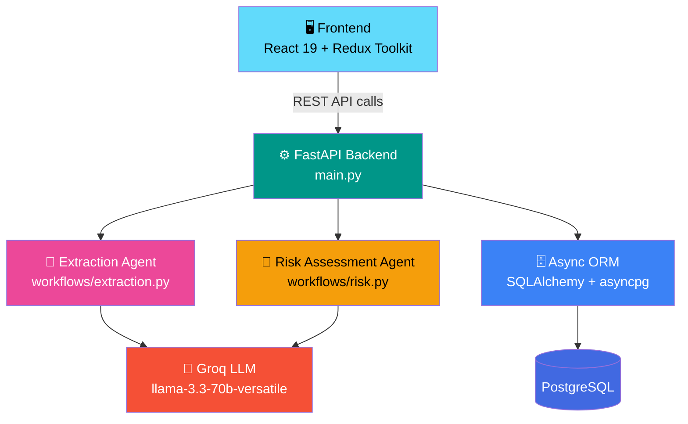
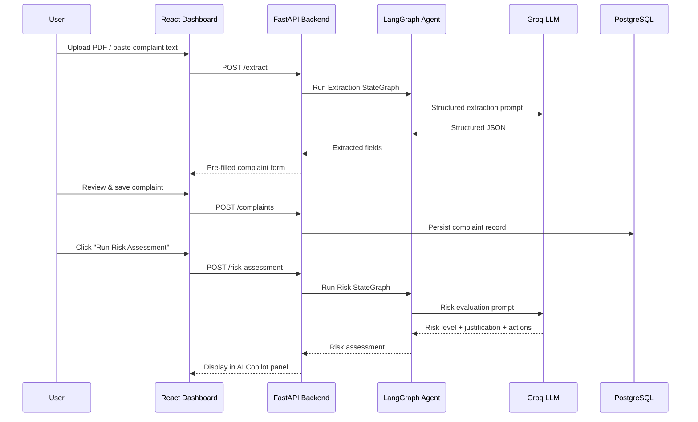
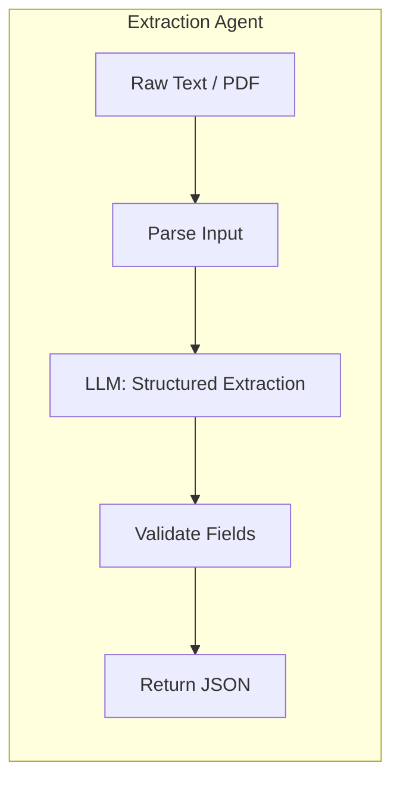
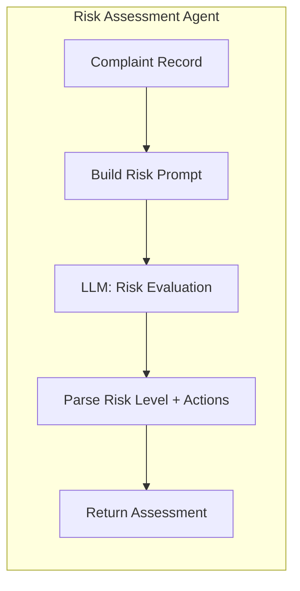

<div align="center">

# 🤖 AI-Powered Customer Complaint Management System

### Intelligent Complaint Intake, AI Extraction & Real-Time Risk Assessment

An AI-assisted complaint management platform for regulated product/quality workflows — automatically extracts structured complaint data from unstructured text or PDFs, and generates real-time AI risk assessments to support QMS (Quality Management System) triage.

[](https://www.python.org/)
[](https://fastapi.tiangolo.com/)
[](https://react.dev/)
[](https://langchain-ai.github.io/langgraph/)
[-F55036?style=for-the-badge)](https://groq.com/)
[](https://www.postgresql.org/)
[](#-license)

[Overview](#-overview) • [Features](#-features) • [Architecture](#-architecture) • [Installation](#-installation) • [API Docs](#-api-documentation) • [Roadmap](#-roadmap)

</div>

---

## 📚 Table of Contents

- [Overview](#-overview)
- [Features](#-features)
- [Architecture](#-architecture)
- [Project Structure](#-project-structure)
- [Installation](#-installation)
- [Environment Variables](#-environment-variables)
- [API Documentation](#-api-documentation)
- [AI Agent Workflows](#-ai-agent-workflows)
- [Security](#-security)
- [Performance](#-performance)
- [Screenshots](#-screenshots)
- [Roadmap](#-roadmap)
- [Deployment](#-deployment)
- [Development Guidelines](#-development-guidelines)
- [License](#-license)
- [Author](#-author)
- [Acknowledgements](#-acknowledgements)

---

## 🎯 Overview

In regulated industries — pharma, consumer products, manufacturing — complaint intake is slow and manual. Someone has to read a complaint letter or PDF, manually key in the product name, batch number, severity, and complaint type, then separately judge how risky the issue is before it reaches a quality reviewer.

**This system automates both steps** with a two-agent AI pipeline built on LangGraph:

1. **Extraction Agent** — parses a raw complaint (PDF upload or pasted text) and returns clean, structured JSON (product, batch number, complaint type, severity, description, received date), which pre-fills the intake form automatically.
2. **Risk Assessment Agent** — analyzes a logged complaint and returns a risk level (Low → Critical), a written justification, and a list of recommended corrective actions — acting as an AI "copilot" for quality reviewers.

Complaints are persisted to PostgreSQL through an async FastAPI backend and reviewed through a React dashboard.

### Why this platform exists

- Complaint documents arrive in inconsistent, unstructured formats (free text, scanned letters, PDFs).
- Manual triage doesn't scale, and risk judgments vary reviewer to reviewer.
- Quality teams need a fast, consistent, auditable first pass — not a replacement for human review, but a copilot that removes the grunt work.

### Target Users

| User Type | Use Case |
|---|---|
| **Quality Assurance / QMS Teams** | Faster complaint triage and consistent risk scoring |
| **Regulatory Affairs** | Structured, exportable records for audits and reporting |
| **Customer Support Teams** | Quickly logging and escalating incoming complaints |
| **Developers** | Extending the LangGraph pipeline with new agent nodes (e.g. CAPA generation) |

### Key Benefits

- ⚡ **Faster intake** — paste or upload a complaint, get a pre-filled form back in seconds
- 🧠 **Consistent risk scoring** — every complaint gets the same structured AI evaluation
- 🗂️ **Explicit, traceable pipelines** — LangGraph state graphs make each AI step inspectable and extensible
- 💾 **Durable records** — async Postgres persistence for every logged complaint

---

## ✨ Features

### 📄 AI Document Extraction
- Upload a complaint PDF or paste raw text
- LLM agent (Groq `llama-3.3-70b-versatile`) extracts structured fields: product name, batch number, complaint type, severity, description, received date
- Auto-fills the complaint logging form — no manual data entry

### 🚦 AI Risk Assessment Copilot
- One-click risk scoring on a logged complaint: **Low → Medium → High → Critical**
- Written justification explaining the reasoning
- Concrete, numbered recommended corrective actions

### 🧠 Agentic Workflows with LangGraph
- Extraction and risk-assessment logic are modeled as explicit `StateGraph` pipelines
- Each pipeline is traceable and testable node-by-node
- Designed to be extended with new nodes (root-cause analysis, CAPA generation, escalation routing)

### 🗄️ Async Persistence
- FastAPI + SQLAlchemy (async) + `asyncpg` for non-blocking database access
- Complaint records stored in PostgreSQL with full field history

### 🎨 Modern React Dashboard
- Redux Toolkit for predictable state management
- Tailwind CSS for a clean, responsive layout
- Three-panel single-page dashboard: AI intake, editable complaint form, AI Copilot risk panel

---

## 🏗️ Architecture



### Request flow



---

## 📁 Project Structure

```
AI-Powered-Customer-Complaint-Management-System/
├── backend/
│   ├── main.py                  # FastAPI app & route definitions
│   ├── models.py                # SQLAlchemy ORM models (Complaint)
│   ├── schemas.py                # Pydantic request/response schemas
│   ├── requirements.txt
│   ├── api/                      # Route modules (extraction, risk, copilot)
│   └── workflows/
│       ├── extraction.py         # LangGraph extraction agent
│       └── risk.py               # LangGraph risk-assessment agent
│
├── frontend/
│   ├── package.json
│   ├── src/
│   │   ├── App.js                 # Main dashboard layout
│   │   ├── store.js                # Redux store configuration
│   │   ├── complaintSlice.js       # Complaint form state
│   │   ├── aiSlice.js               # AI risk/extraction state
│   │   └── components/
│   │       ├── ComplaintIntake.js   # PDF/text upload → AI extraction
│   │       ├── ComplaintForm.js      # Manual complaint entry & save
│   │       └── AiCopilotPanel.js      # AI risk assessment panel
│   └── public/
│
├── docs/
│   └── screenshots/
├── README.md
└── LICENSE
```

---

## 🚀 Installation

### Prerequisites

- Python 3.10+
- Node.js 18+ and npm
- A PostgreSQL database (local or hosted, e.g. [Neon](https://neon.tech))
- A [Groq API key](https://console.groq.com) (free tier available)

### 1. Clone the repository

```bash
git clone https://github.com/ymanoj7745-lgtm/AI-Powered-Customer-Complaint-Management-System.git
cd AI-Powered-Customer-Complaint-Management-System
```

### 2. Backend setup

```bash
cd backend
python -m venv venv
source venv/bin/activate      # On Windows: venv\Scripts\activate
pip install -r requirements.txt
```

Create a `.env` file inside `backend/`:

```env
DATABASE_URL=postgresql+asyncpg://<user>:<password>@<host>/<dbname>
GROQ_API_KEY=your_groq_api_key_here
```

Run the API server:

```bash
uvicorn main:app --reload --port 8000
```

The API will be available at `http://localhost:8000`, with interactive docs at `http://localhost:8000/docs`.

### 3. Frontend setup

```bash
cd ../frontend
npm install
npm start
```

The dashboard will be available at `http://localhost:3000`.

---

## 🔧 Environment Variables

| Variable | Description | Required |
|---|---|---|
| `DATABASE_URL` | Async PostgreSQL connection string (`postgresql+asyncpg://...`) | ✅ Yes |
| `GROQ_API_KEY` | API key for Groq-hosted LLM inference | ✅ Yes |

> ⚠️ **Security Callout:** Never commit `.env` files or API keys to version control.

---

## 📖 API Documentation

> Interactive API docs are auto-generated by FastAPI and available at `/docs` (Swagger UI) once the backend is running.

### 📄 `POST /extract`

Extract structured complaint data from raw text or an uploaded PDF.

**Request**
```bash
curl -X POST http://localhost:8000/extract \
  -F "text=Batch #A102 of ProductX arrived with a cracked seal, received 2026-07-01."
```

**Response**
```json
{
  "product_name": "ProductX",
  "batch_number": "A102",
  "complaint_type": "Packaging",
  "severity": "Medium",
  "description": "Cracked seal on arrival",
  "received_date": "2026-07-01"
}
```

---

### 🚦 `POST /risk-assessment`

Run an AI risk assessment on a complaint.

**Request**
```json
{
  "product_name": "Acme UltraGlow Face Cream",
  "batch_number": "84729X",
  "complaint_type": "Product Quality",
  "severity": "High",
  "description": "The cream was completely separated and smelled rancid, causing a severe red rash and burning sensation when applied"
}
```

**Response**
```json
{
  "risk_level": "Critical",
  "justification": "The complaint describes a severe adverse reaction associated with a product quality issue, indicating a potential serious health risk to consumers.",
  "recommended_actions": [
    "Immediately recall all units of the affected batch",
    "Conduct a thorough investigation into the cause of the product quality issue",
    "Perform additional testing to determine the extent of the problem",
    "Notify regulatory authorities and report the incident",
    "Provide medical assistance and compensation to the affected consumer"
  ]
}
```

---

### 💾 `POST /complaints`

Persist a complaint record to the database.

**Request**
```json
{
  "product_name": "Acme UltraGlow Face Cream",
  "batch_number": "84729X",
  "complaint_type": "Product Quality",
  "severity": "High",
  "description": "The cream was completely separated and smelled rancid, causing a severe red rash and burning sensation when applied",
  "received_date": "2026-08-01"
}
```

**Response**
```json
{
  "id": 42,
  "status": "saved",
  "created_at": "2026-08-06T09:30:17Z"
}
```

> 📌 Response fields illustrate the expected contract based on `schemas.py`. Verify exact field names against your local copy if it has diverged.

---

## 🔄 AI Agent Workflows

Both AI features are modeled as **LangGraph `StateGraph`** pipelines rather than single prompt calls, so each step is inspectable and independently extensible.





---

## 🔒 Security

- **Environment-based secrets** — `DATABASE_URL` and `GROQ_API_KEY` are read from environment variables, never hardcoded.
- **Input validation** — Request payloads are validated via FastAPI's Pydantic schemas (`schemas.py`) to reject malformed input.
- **Async DB access** — Non-blocking SQLAlchemy sessions reduce the risk of connection exhaustion under load.

> 🛡️ **Security Callout:** This project currently has no authentication layer on its API routes. Before any production or multi-user deployment, add authentication (e.g. JWT), rate limiting, and CORS restrictions.

---

## ⚡ Performance

- **FastAPI Async Support** — Non-blocking I/O for both database access and LLM calls.
- **Groq Inference** — Groq's LPU-based hosting gives low-latency structured JSON generation compared to typical GPU-hosted inference.
- **Stateless Agents** — Each LangGraph run is independent, so extraction and risk-assessment requests can be scaled horizontally behind the FastAPI app.

---

## 🖼️ Screenshots

**Dashboard — AI Document Extraction, Complaint Logging & AI Copilot**


The dashboard combines three panels: drag-and-drop AI document extraction (top-left), the editable complaint form pre-filled from extracted data (bottom-left), and the AI Copilot risk assessment panel (right), which returns a risk level, justification, and recommended actions in real time.

---

## 🗺️ Roadmap

- [ ] Root-cause analysis agent (extend the LangGraph risk pipeline)
- [ ] Automated CAPA (Corrective and Preventive Action) suggestion node
- [ ] Authentication & role-based access (QA reviewer vs. submitter)
- [ ] Complaint analytics dashboard (trends by product/severity/type)
- [ ] Dockerized deployment (backend + frontend + Postgres via Compose)
- [ ] REST API versioning (`/api/v1`)
- [ ] Export complaints & risk reports to PDF/Excel

---

## ☁️ Deployment

### Backend

```bash
pip install -r requirements.txt
gunicorn main:app -w 4 -k uvicorn.workers.UvicornWorker --bind 0.0.0.0:8000
```

### Frontend

```bash
npm run build
# Serve the /build output via your static hosting provider of choice
```

### Production considerations

- Set `DATABASE_URL` and `GROQ_API_KEY` via your hosting provider's secret manager — never in build artifacts.
- Add an authentication layer and CORS restrictions before exposing the API publicly.
- Use a managed Postgres provider (e.g. Neon, Supabase, RDS) for production data durability.

---

## 👨‍💻 Development Guidelines

### Coding Standards

- Follow **PEP 8** for backend Python code.
- Keep route handlers thin — extraction/risk logic belongs in `workflows/`, not `main.py`.
- Use consistent component and slice naming in the React frontend.

### Contribution Workflow

1. Fork the repository
2. Create a feature branch (`git checkout -b feature/your-feature-name`)
3. Commit with clear, descriptive messages
4. Push to your fork and open a Pull Request describing **what** changed and **why**

### Git Branching Strategy

| Branch | Purpose |
|---|---|
| `main` | Stable, production-ready code |
| `develop` | Active development integration branch |
| `feature/*` | Individual feature development |
| `hotfix/*` | Urgent production fixes |

---

## 📄 License

This project is licensed under the **MIT License**.

```
MIT License

Copyright (c) 2026 Manoj Yadav

Permission is hereby granted, free of charge, to any person obtaining a copy
of this software and associated documentation files (the "Software"), to deal
in the Software without restriction, including without limitation the rights
to use, copy, modify, merge, publish, distribute, sublicense, and/or sell
copies of the Software, subject to the following conditions:

The above copyright notice and this permission notice shall be included in
all copies or substantial portions of the Software.

THE SOFTWARE IS PROVIDED "AS IS", WITHOUT WARRANTY OF ANY KIND, EXPRESS OR
IMPLIED, INCLUDING BUT NOT LIMITED TO THE WARRANTIES OF MERCHANTABILITY,
FITNESS FOR A PARTICULAR PURPOSE AND NONINFRINGEMENT.
```

See the [LICENSE](./LICENSE) file for full details.

---

## 👤 Author

<div align="center">

**Manoj Yadav**

AI/ML Engineer

[](https://github.com/ymanoj7745-lgtm)
[](https://linkedin.com/in/ymanoj7745)
[](mailto:ymanoj7745@gmail.com)

</div>

---

## 🙏 Acknowledgements

- [**FastAPI**](https://fastapi.tiangolo.com/) — high-performance async Python web framework
- [**LangGraph**](https://langchain-ai.github.io/langgraph/) — explicit, stateful agent orchestration
- [**Groq**](https://groq.com/) — low-latency LLM inference (Llama 3.3 70B)
- [**React**](https://react.dev/) — component-driven frontend architecture
- [**SQLAlchemy**](https://www.sqlalchemy.org/) — async ORM for PostgreSQL
- The broader **open-source community**

---

<div align="center">

**⭐ If you find this project useful, consider giving it a star on GitHub! ⭐**

Made with care by [Manoj Yadav](https://github.com/ymanoj7745-lgtm)

</div>
